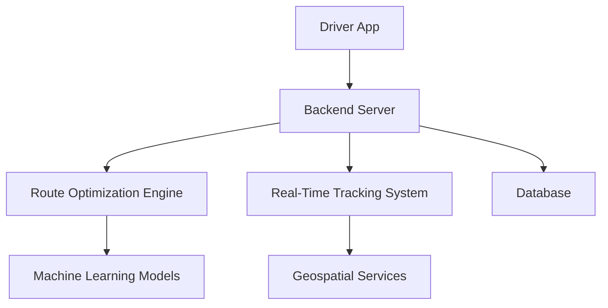

# Trackiny 🚚✨

## Revolutionizing Logistics Through Smart Technology


### Quick Links
- [Overview](#overview)
- [Features](#features)
- [Technologies](#technologies)
- [Installation](#installation)
- [Getting Started](#getting-started)
- [Dashboard Preview](#dashboard-preview)
- [Demo Video](https://www.canva.com/design/DAGeh2ZUciw/FIOMpEwVR1hl8AE-eLH0xw/edit?ui=eyJFIjp7IkFfIjoiSCJ9LCJHIjp7IkEiOnRydWV9fQ)

## Overview

Trackiny is an innovative logistics platform designed to transform transportation management through cutting-edge technology. By leveraging automation, real-time tracking, and intelligent route optimization, we help businesses reduce operational costs and enhance delivery efficiency.


## Key Problems We Solve

- **High Operational Costs:** Reduce manual logistics management expenses
- **Inefficient Route Planning:** Optimize delivery routes for time and fuel savings
- **Lack of Real-Time Visibility:** Provide transparent, up-to-the-minute tracking
- **Complex Driver Management:** Simplify driver task allocation and monitoring

## Features

### 🚀 Automated Logistics Management
- Intelligent task allocation
- Automatic route optimization
- Reduced manual intervention
- Cost-effective operational model

### 📱 Advanced Driver Application
- Real-time delivery tracking
- Intuitive task management interface
- GPS-enabled route navigation
- Instant status update capabilities

### 🗺️ Smart Route Optimization
- Machine learning-powered route planning
- Considers traffic, distance, and delivery windows
- Minimizes fuel consumption
- Reduces overall transportation time

### 📊 Comprehensive Tracking System
- End-to-end shipment visibility
- Detailed delivery performance metrics
- Customizable reporting dashboard
- Real-time alerts and notifications

## Technologies

### Frontend
- **Next.js:** High-performance React framework
- **TypeScript:** Enhanced JavaScript with strong typing
- **Tailwind CSS:** Utility-first styling framework

### Backend
- **Node.js**
- **Express.js**
- **PostgreSQL**
- **Prisma ORM**

### Geospatial & Tracking
- **Google Maps API**
- **Mapbox**
- **WebSocket for Real-Time Updates**

## System Architecture



## Installation

### Prerequisites
- Node.js (v18+)
- npm or yarn
- PostgreSQL

### Setup Steps
1. Clone the repository
   ```bash
   git clone https://github.com/yourusername/trackiny.git
   cd trackiny
   ```

2. Install dependencies
   ```bash
   npm install
   ```

3. Configure environment variables
   ```bash
   cp .env.example .env
   # Edit .env with your configuration
   ```

4. Run database migrations
   ```bash
   npx prisma migrate dev
   ```

5. Start development server
   ```bash
   npm run dev
   ```

## Deployment

- **Vercel:** One-click deployment for Next.js
- **Docker Support:** Containerized deployment
- **CI/CD:** GitHub Actions configured

## Roadmap

- [ ] Mobile app development
- [ ] Advanced predictive analytics
- [ ] Multi-language support
- [ ] Enhanced machine learning route optimization

## Contributing

Interested in contributing? Great! Please read our [CONTRIBUTING.md](CONTRIBUTING.md) for details on our code of conduct and the process for submitting pull requests.

## License

This project is licensed under the MIT License - see the [LICENSE.md](LICENSE.md) file for details.

## Contact

**Project Maintainer:** [Your Name]
- Email: aymendridforwork@gmail.com
- LinkedIn: [[Aymen-drid](https://www.linkedin.com/in/aymen-drid-36bba4243/)]
- Project Link: [https://github.com/Aymen-drid/tatweer-event](https://github.com/Aymen-drid/tatweer-event)

---

**Made with ❤️ by the Trackiny Team**

    Getting Started
    Dashboard Preview
    Demo Video

Overview

Trackiny is an innovative logistics platform designed to transform transportation management through cutting-edge technology. By leveraging automation, real-time tracking, and intelligent route optimization, we help businesses reduce operational costs and enhance delivery efficiency.

Dashboard Overview
Key Problems We Solve
